# Architecture Overview - Context Engineering Template

A visual guide to the system architecture, components, and how they interact.

---

## System Architecture Diagram

```mermaid
graph TB
    subgraph "Input Layer"
        USER["👤 User Request"]
        CONFIG["⚙️ Configuration"]
    end
    
    subgraph "Core Engine"
        CTX["📋 Context Builder"]
        TOOLS["🔧 Tool Registry"]
        EXEC["⚡ Executor"]
    end
    
    subgraph "Processing"
        ANALYZE["🔍 Analysis Engine"]
        PROOF["✓ Proof Generator"]
        FEEDBACK["📊 Feedback System"]
    end
    
    subgraph "Output Layer"
        RESULT["📤 Result"]
        METRICS["📈 Metrics"]
        TESTS["🧪 Generated Tests"]
    end
    
    USER --> CTX
    CONFIG --> CTX
    CTX --> TOOLS
    TOOLS --> EXEC
    EXEC --> ANALYZE
    ANALYZE --> PROOF
    PROOF --> FEEDBACK
    FEEDBACK --> RESULT
    FEEDBACK --> METRICS
    FEEDBACK --> TESTS
```

---

## Component Relationships

---

## Data Flow - Complete Pipeline

---

## Layered Architecture

---

## Component Interaction Map

### Context Management System

### Tool Execution System

### Feedback & Analysis System

### Proof Steps System

---

## File Organization

---

## Technology Stack

---

## Key Principles

---

## Next Steps

For detailed information, see:
- **[WORKFLOW_DIAGRAMS.md](WORKFLOW_DIAGRAMS.md)** - Detailed workflow flows
- **[CALL_STACK_DIAGRAMS.md](CALL_STACK_DIAGRAMS.md)** - Execution call stacks
- **[FEATURES_AND_COMPONENTS.md](FEATURES_AND_COMPONENTS.md)** - Feature documentation
- **[DOCUMENTATION_INDEX.md](DOCUMENTATION_INDEX.md)** - Navigation hub
