# Call Stack Diagrams - Execution Traces

Detailed call stack diagrams showing how functions call each other during execution of the main workflows.

---

## 1. Basic Workflow Call Stack

How the basic workflow executes step-by-step through the codebase.

### Complete Execution Stack

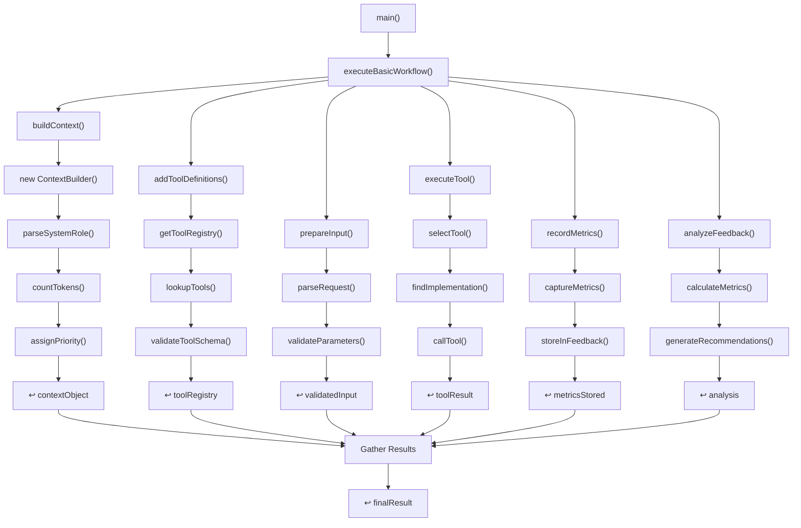

### Function Call Hierarchy

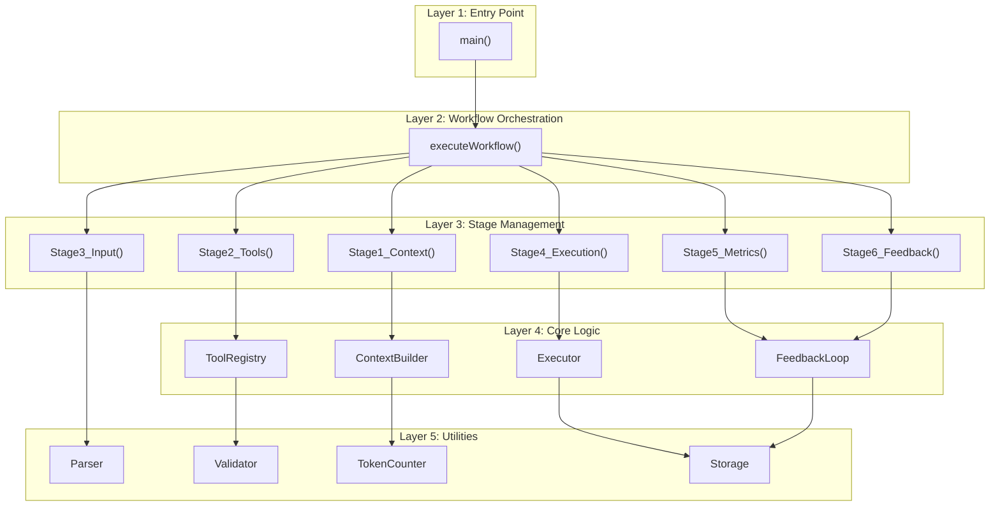

### Parameter Passing Through Stack

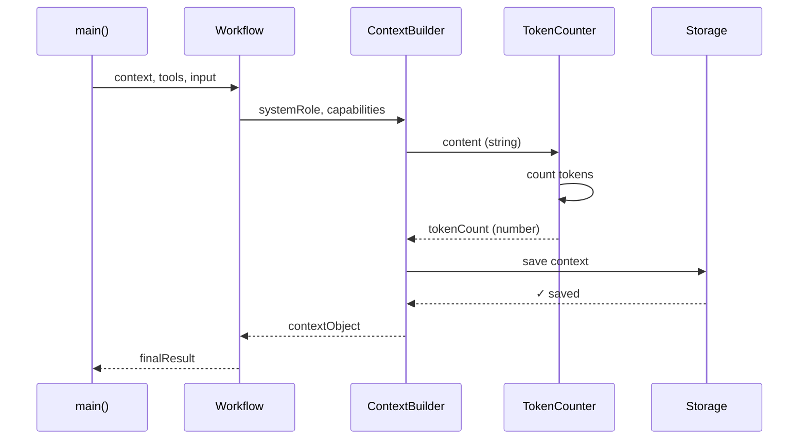

---

## 2. Advanced Workflow Call Stack

Multi-tool execution with dependency management.

### Multi-Tool Orchestration Stack

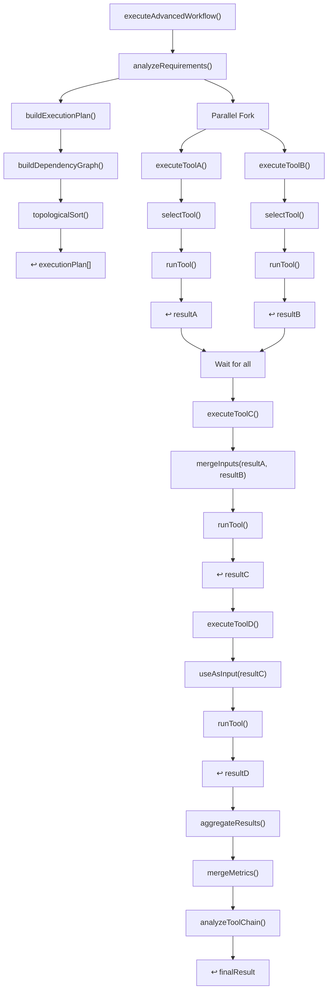

### Tool Execution Tree with Timing

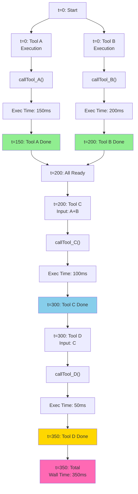

### Error Handling Call Stack

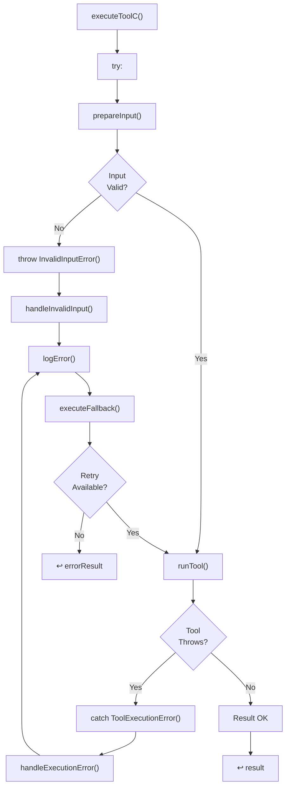

---

## 3. Proof Steps Call Stack

Generation and validation of test proofs.

### Proof Generation Stack

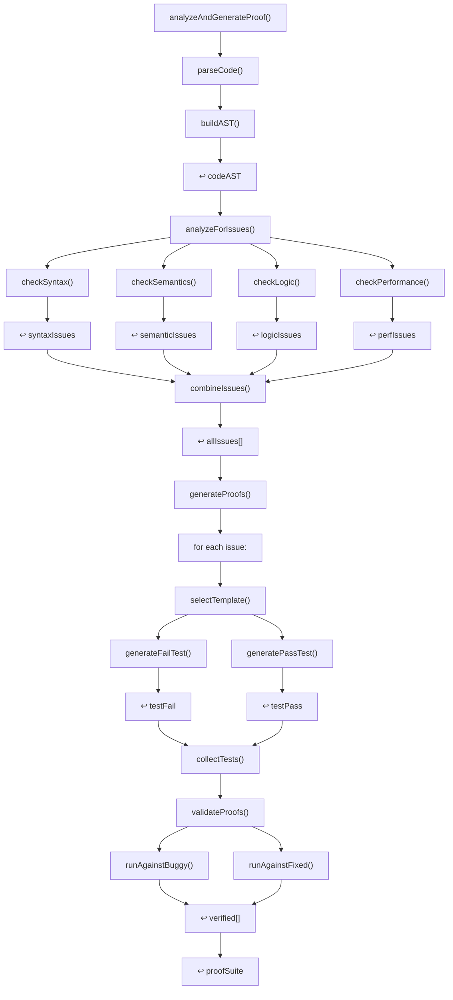

### Test Generation Templates

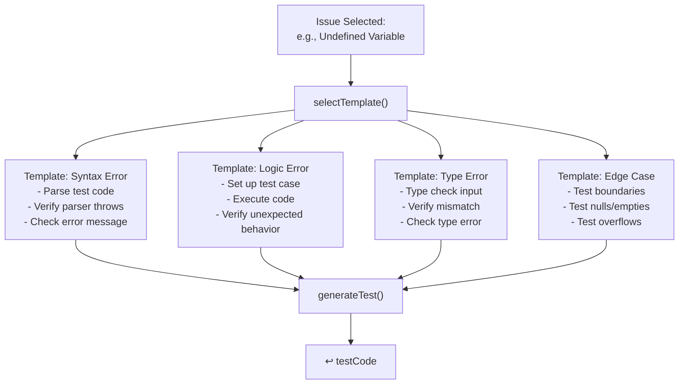

### Proof Validation Stack

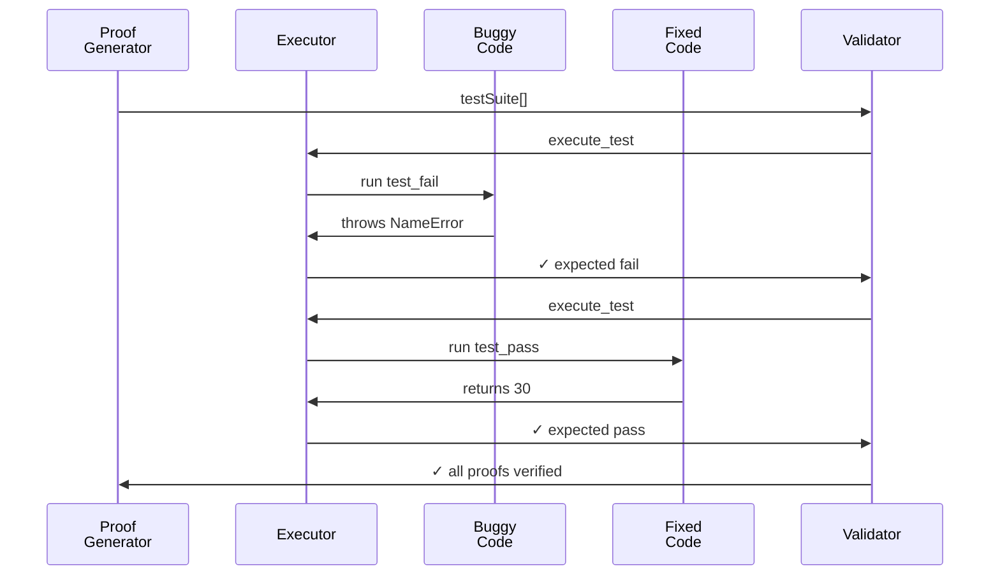

---

## 4. Context Building Call Stack

Detailed stack for context construction and optimization.

### Context Construction Stack

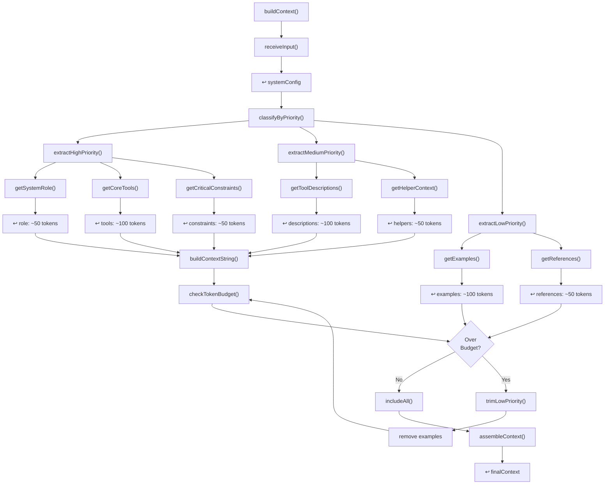

### Token Counting Call Stack

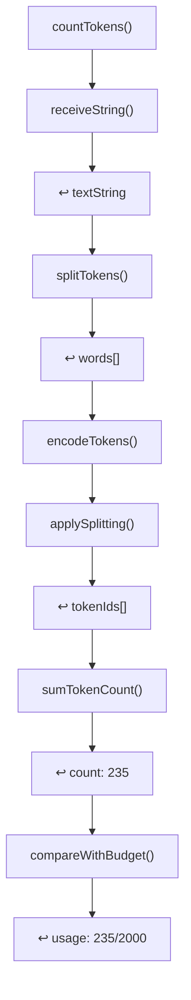

---

## 5. Feedback Loop Call Stack

How feedback is recorded, analyzed, and used.

### Metrics Recording Stack

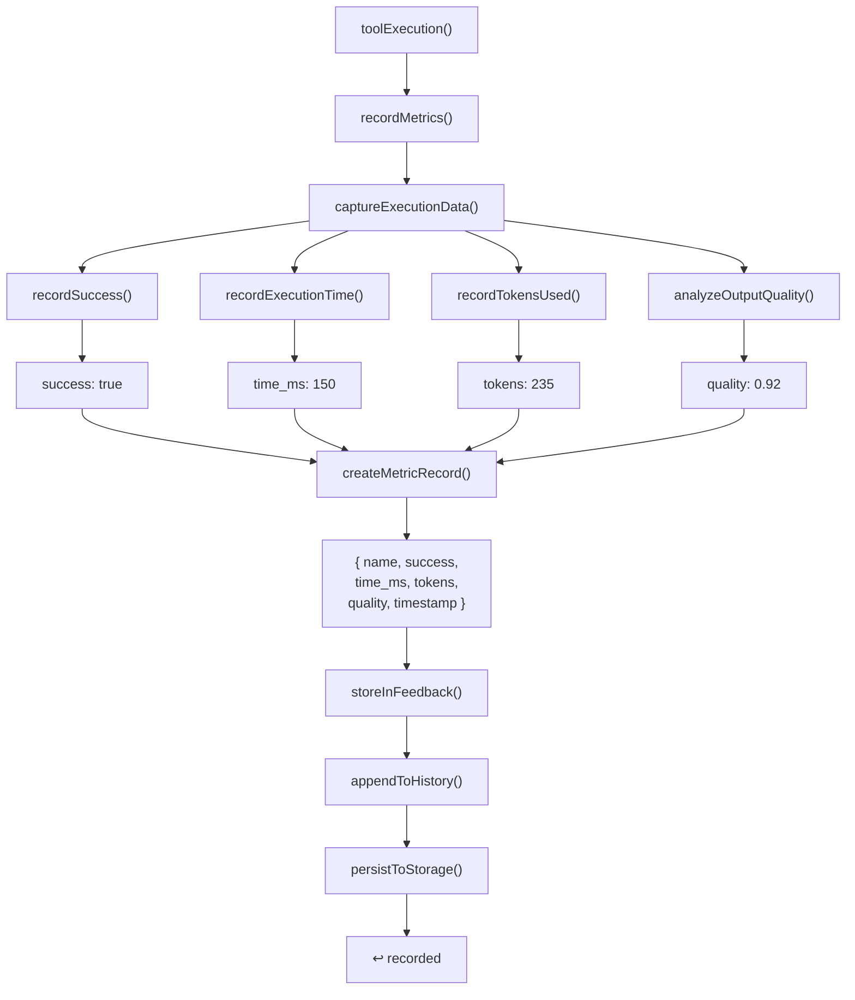

### Analysis Stack

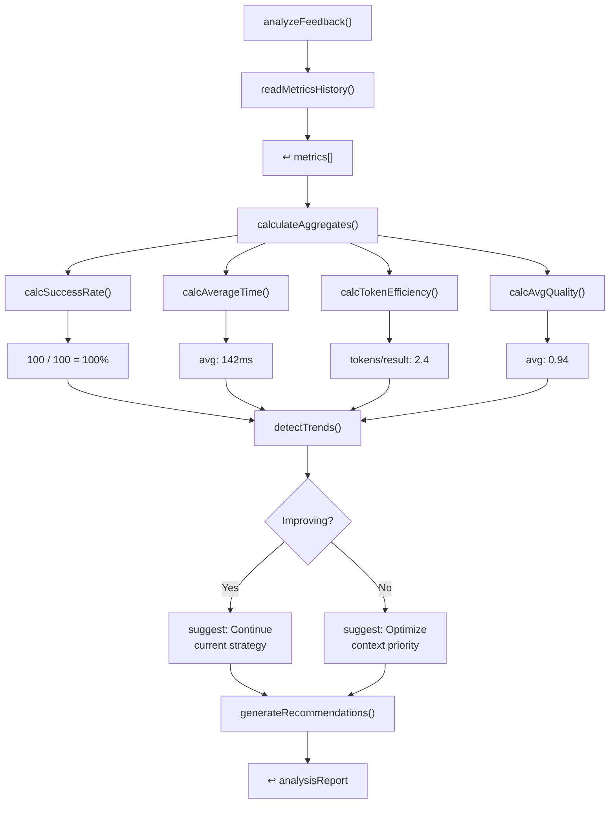

---

## Next Steps

For more details:
- **[ARCHITECTURE_OVERVIEW.md](ARCHITECTURE_OVERVIEW.md)** - System components
- **[WORKFLOW_DIAGRAMS.md](WORKFLOW_DIAGRAMS.md)** - Workflow visualizations
- **[FEATURES_AND_COMPONENTS.md](FEATURES_AND_COMPONENTS.md)** - Feature deep-dives
