# Features and Components - Complete Feature Documentation

Detailed documentation of each major feature, component, and their interactions with visual diagrams.

---

## 📦 Component Overview


---

## 🔧 Feature 1: Tool System

### Purpose
Define and manage available tools that the system can call. Tools are the primary mechanism for extending system capabilities.

### Architecture


### Usage Example

```typescript
// Define a tool
const analyzeCodeTool = {
    name: "analyze_code",
    description: "Analyzes code for issues and suggests improvements",
    parameters: {
        code: { type: "string", required: true },
        language: { type: "string", required: true },
        checks: { type: "array", required: false }
    },
    returns: {
        issues: "array of issues found",
        complexity: "complexity score",
        suggestions: "improvement suggestions"
    },
    priority: "HIGH"
};

// Register tool
toolRegistry.addTool(analyzeCodeTool);

// Use tool
const result = await executor.callTool("analyze_code", {
    code: "function test() { ... }",
    language: "javascript"
});
```

### Key Methods

```mermaid
graph TD
    A["Tool Registry"]
    
    A --> M1["addTool()"]
    M1 --> "|Registers| new tool"
    
    A --> M2["getTool()"]
    M2 --> "|Retrieves| tool by name"
    
    A --> M3["listTools()"]
    M3 --> "|Returns| all registered tools"
    
    A --> M4["validateParameters()"]
    M4 --> "|Ensures| correct parameters"
    
    A --> M5["executeToolFunction()"]
    M5 --> "|Calls| tool implementation"
```

---

## 📋 Feature 2: Context Management System

### Purpose
Build and manage context that guides system behavior while staying within token budgets.

### Context Layers


### Context Building Process


### Configuration Options

```mermaid
graph TB
    CONFIG["Context Configuration"]
    
    CONFIG --> TOKEN_BUDGET["token_budget: 2000"]
    CONFIG --> SYSTEM_ROLE["system_role: string"]
    CONFIG --> TOOLS["tools: Tool[]"]
    CONFIG --> CONSTRAINTS["constraints: string"]
    CONFIG --> PRIORITY_WEIGHTS["priority_weights: {<br/>HIGH: 1.0,<br/>MEDIUM: 0.7,<br/>LOW: 0.3<br/>}"]
    
    TOKEN_BUDGET --> OUTPUT["→ Configure<br/>maximum tokens"]
    SYSTEM_ROLE --> OUTPUT["→ Define system<br/>behavior"]
    TOOLS --> OUTPUT["→ Specify available<br/>tools"]
    CONSTRAINTS --> OUTPUT["→ Set limitations"]
    PRIORITY_WEIGHTS --> OUTPUT["→ Tune priorities"]
```



---

## ⚡ Feature 3: Execution Engine

### Purpose
Execute tools with proper parameter validation, error handling, and result capture.

### Execution Pipeline


### Error Handling Hierarchy

```mermaid
graph TD
    EXEC["Tool Execution"]
    
    EXEC --> L1{"Tool<br/>Exists?"}
    L1 -->|No| E1["ToolNotFoundError<br/>→ Log & return error"]
    L1 -->|Yes| L2{"Params<br/>Valid?"}
    
    L2 -->|No| E2["ParameterError<br/>→ Log validation failure"]
    L2 -->|Yes| L3{"Execute<br/>OK?"}
    
    L3 -->|Exception| E3["ToolExecutionError<br/>→ Capture stack trace"]
    L3 -->|Success| OK["✓ Return result"]
    
    E1 --> RECORD["Record error<br/>in metrics"]
    E2 --> RECORD
    E3 --> RECORD
    OK --> RECORD
    
    RECORD --> FEEDBACK["Feed to feedback<br/>system"]
```



### Retry Strategy

```mermaid
graph TD
    CALL["Tool Call"]
    
    CALL --> ATTEMPT["Attempt 1"]
    ATTEMPT --> CHECK1{Success?}
    CHECK1 -->|Yes| DONE1["✓ Return"]
    CHECK1 -->|No| RETRY1["Retry?"]
    
    RETRY1 -->|Yes| BACKOFF["Wait<br/>100ms"]
    RETRY1 -->|No| FAIL["Fail"]
    
    BACKOFF --> ATTEMPT2["Attempt 2"]
    ATTEMPT2 --> CHECK2{Success?}
    CHECK2 -->|Yes| DONE2["✓ Return"]
    CHECK2 -->|No| RETRY2["Retry?"]
    
    RETRY2 -->|Yes| BACKOFF2["Wait<br/>200ms"]
    RETRY2 -->|No| FAIL
    
    BACKOFF2 --> ATTEMPT3["Attempt 3"]
    ATTEMPT3 --> CHECK3{Success?}
    CHECK3 -->|Yes| DONE3["✓ Return"]
    CHECK3 -->|No| FAIL["❌ Max retries<br/>exceeded"]
```



---

## 📊 Feature 4: Feedback System

### Purpose
Collect metrics from execution and generate insights to optimize future executions.

### Metrics Collection


### Analysis Cycle


### Metrics Dashboard

```mermaid
graph TB
    subgraph "Real-Time"
        RT1["Current Tool:<br/>analyze_code"]
        RT2["Time: 142ms"]
        RT3["Success: ✓"]
        RT4["Quality: 0.95"]
    end
    
    subgraph "Session (Last Hour)"
        S1["Executions: 47"]
        S2["Avg Time: 145ms"]
        S3["Success: 94%"]
        S4["Avg Quality: 0.92"]
    end
    
    subgraph "Trends"
        T1["Direction: ↗ Improving"]
        T2["Quality trend: +2%"]
        T3["Speed trend: -5ms"]
    end
    
    RT1 -.-> S1
    RT2 -.-> S2
    RT3 -.-> S3
    RT4 -.-> S4
    
    S1 -.-> T1
    S2 -.-> T2
    S3 -.-> T3
```



---

## ✓ Feature 5: Proof Steps System

### Purpose
Automatically generate unit tests that prove issues exist and verify solutions work.

### Complete Flow


### Test Generation Templates

#### Template 1: Syntax Error Proof


#### Template 2: Logic Error Proof


#### Template 3: Edge Case Proof


### Issue Detection Levels

```mermaid
graph TB
    CODE["Source<br/>Code"]
    
    CODE --> L1["Level 1:<br/>SYNTAX<br/>Parsing<br/>errors"]
    L1 --> CHECK1{Valid?}
    
    CHECK1 -->|No| SYNTAX["🔴 Syntax<br/>Error"]
    CHECK1 -->|Yes| L2
    
    L2["Level 2:<br/>SEMANTIC<br/>Undefined<br/>vars, types"]
    L2 --> CHECK2{Valid?}
    
    CHECK2 -->|No| SEMANTIC["🟠 Semantic<br/>Error"]
    CHECK2 -->|Yes| L3
    
    L3["Level 3:<br/>LOGIC<br/>Algorithm<br/>errors"]
    L3 --> CHECK3{Valid?}
    
    CHECK3 -->|No| LOGIC["🟡 Logic<br/>Error"]
    CHECK3 -->|Yes| L4
    
    L4["Level 4:<br/>PERFORMANCE<br/>Inefficiency"]
    L4 --> CHECK4{Good?}
    
    CHECK4 -->|No| PERF["🟢 Performance<br/>Issue"]
    CHECK4 -->|Yes| CLEAN["✅ All Clear"]
    
    SYNTAX --> ISSUES["Issues<br/>List"]
    SEMANTIC --> ISSUES
    LOGIC --> ISSUES
    PERF --> ISSUES
```



---

## 🌐 Feature 6: Language Agnostic Design

### Purpose
Same specifications work across multiple programming languages with language-specific implementations.

### Multi-Language Architecture


### Tool Portability


---

## 📚 Component Dependencies


---

## 🔄 Feature Integration Example

### Scenario: Code Analysis with Proof Steps

```mermaid
graph TD
    INPUT["User: Analyze this<br/>code for issues"]
    
    INPUT --> STEP1["1. Build Context<br/>→ Context System"]
    STEP1 --> CTX["Context ready:<br/>~300 tokens<br/>- System role<br/>- analyze_code tool<br/>- Constraints"]
    
    CTX --> STEP2["2. Execute Tool<br/>→ Execution Engine"]
    STEP2 --> EXEC["Execute analyze_code<br/>Parameters: code,<br/>language='python'"]
    
    EXEC --> RESULT["Tool Result:<br/>- Issues found<br/>- Suggestions<br/>- Code complexity"]
    
    RESULT --> STEP3["3. Record Metrics<br/>→ Feedback System"]
    STEP3 --> METRICS["Metrics:<br/>- Time: 145ms<br/>- Success: ✓<br/>- Quality: 0.95<br/>- Tokens: 235"]
    
    METRICS --> STEP4["4. Generate Proofs<br/>→ Proof Generator"]
    STEP4 --> PROOF["Proofs generated:<br/>- Test for Issue 1<br/>- Test for Issue 2<br/>- Edge case tests"]
    
    PROOF --> STEP5["5. Analyze & Report<br/>→ Feedback System"]
    STEP5 --> FINAL["Final Report:<br/>- Issues identified<br/>- Tests generated<br/>- Recommendations<br/>- Metrics summary"]
    
    FINAL --> OUTPUT["✓ Output to user"]
```

---

## 📈 Performance Characteristics

### Execution Time by Feature

```mermaid
graph LR
    CONTEXT["Context<br/>Building<br/>10-50ms"]
    EXEC["Tool<br/>Execution<br/>100-500ms"]
    FEEDBACK["Feedback<br/>Analysis<br/>20-100ms"]
    PROOF["Proof<br/>Generation<br/>50-200ms"]
    
    CONTEXT -->|Total| TOTAL["Complete<br/>Workflow<br/>180-850ms"]
    EXEC --> TOTAL
    FEEDBACK --> TOTAL
    PROOF --> TOTAL
```

### Scalability

```mermaid
graph TB
    REQUESTS["Requests per Hour"]
    
    REQUESTS --> R1["1 request<br/>- Basic workflow<br/>- Single tool<br/>- ~500ms"]
    
    REQUESTS --> R10["10 requests<br/>- Parallel<br/>- Cache context<br/>- ~100ms each"]
    
    REQUESTS --> R100["100 requests<br/>- Batch<br/>- Shared context<br/>- ~50ms each"]
    
    R1 --> THROUGHPUT["Throughput:<br/>~7,200 req/hr<br/>single machine"]
```

---

## Next Steps

For implementation details:
- **[ARCHITECTURE_OVERVIEW.md](ARCHITECTURE_OVERVIEW.md)** - Component structure
- **[CALL_STACK_DIAGRAMS.md](CALL_STACK_DIAGRAMS.md)** - Function calls
- **[WORKFLOW_DIAGRAMS.md](WORKFLOW_DIAGRAMS.md)** - Complete flows
- **[GUIDE.md](GUIDE.md)** - How to use
