# Workflow Diagrams - Complete Flow Visualization

Detailed diagrams for each workflow type showing the complete execution flow from start to finish.

---

## 1. Basic Workflow: Execute → Analyze → Feedback

The foundational workflow for executing a tool and analyzing results.

### Complete Flow

### Data Flow Through Stages

### Metrics Collection Flow

---

## 2. Advanced Workflow: Multi-Tool Orchestration

Handling complex scenarios with multiple tools and dependencies.

### Multi-Tool Execution Flow

### Tool Dependency Graph

```mermaid
graph TB
    START("🟢 Start") --> T1["Tool 1<br/>analyze_code"]
    START --> T2["Tool 2<br/>check_syntax"]
    
    T1 --> T3["Tool 3<br/>suggest_fixes<br/>(depends on 1+2)"]
    T2 --> T3
    
    T3 --> T4["Tool 4<br/>generate_tests<br/>(depends on 1+3)"]
    T1 --> T4
    
    T4 --> T5["Tool 5<br/>validate_solution<br/>(depends on 4)"]
    
    T5 --> END("🔴 End")
    
    style T1 fill:#FFE4B5
    style T2 fill:#FFE4B5
    style T3 fill:#FFD700
    style T4 fill:#DDA0DD
    style T5 fill:#90EE90
    style START fill:#00FF00
    style END fill:#FF0000
```

### Parallel Execution with Fallback

```mermaid
graph TD
    REQ["Request"] --> FORK["Fork<br/>Two Approaches"]
    
    FORK --> PATH_A["Path A<br/>Strategy 1<br/>Tool Set: A, B, C"]
    FORK --> PATH_B["Path B<br/>Strategy 2<br/>Tool Set: X, Y, Z"]
    
    PATH_A --> EXEC_A["Execute A→B→C"]
    PATH_B --> EXEC_B["Execute X→Y→Z"]
    
    EXEC_A --> CHECK_A{Success?}
    EXEC_B --> CHECK_B{Success?}
    
    CHECK_A -->|Yes| RESULT_A["✓ Use Result A<br/>Metrics: Fast"]
    CHECK_A -->|No| RESULT_A_FAIL["✗ Path A Failed"]
    
    CHECK_B -->|Yes| RESULT_B["✓ Use Result B<br/>Metrics: Slower"]
    CHECK_B -->|No| RESULT_B_FAIL["✗ Path B Failed"]
    
    RESULT_A --> MERGE["Merge Results<br/>& Metrics"]
    RESULT_B --> MERGE
    RESULT_A_FAIL --> FALLBACK["Use fallback<br/>strategy"]
    RESULT_B_FAIL --> FALLBACK
    FALLBACK --> MERGE
    
    MERGE --> OUTPUT["Output"]
```

---

## 3. Proof Steps Workflow: Test Generation & Verification

Complete flow for identifying issues, generating proofs, and validating fixes.

### Proof Steps Complete Pipeline

```mermaid
graph TD
    START([Start]) --> ANALYZE["Phase 1: ANALYZE<br/>Input: Code snippet"]
    
    ANALYZE --> DETECT["Detect Issues:<br/>- Syntax errors<br/>- Logic errors<br/>- Type mismatches<br/>- Performance issues"]
    
    DETECT --> ISSUES["Issues Found:<br/>- Issue 1: [details]<br/>- Issue 2: [details]<br/>- ..."]
    
    ISSUES --> CHOOSE["Choose Issue<br/>to Resolve"]
    
    CHOOSE --> GENERATE["Phase 2: GENERATE<br/>Create proof tests"]
    
    GENERATE --> TEST_FAIL["Test 1: Failure Case<br/>├─ Reproduces issue<br/>├─ Demonstrates bug<br/>└─ MUST FAIL with<br/>   buggy code"]
    
    GENERATE --> TEST_PASS["Test 2: Success Case<br/>├─ Fixes issue<br/>├─ Shows solution<br/>└─ MUST PASS with<br/>   fixed code"]
    
    GENERATE --> TEST_EDGE["Test 3+: Edge Cases<br/>├─ Boundary conditions<br/>├─ Error handling<br/>└─ Prevents regressions"]
    
    TEST_FAIL --> VALIDATE["Phase 3: VALIDATE"]
    TEST_PASS --> VALIDATE
    TEST_EDGE --> VALIDATE
    
    VALIDATE --> RUN_BUGGY["Run against<br/>buggy code"]
    RUN_BUGGY --> CHECK_BUGGY{Test results<br/>as expected?}
    
    CHECK_BUGGY -->|Yes| RUN_FIXED["Run against<br/>fixed code"]
    CHECK_BUGGY -->|No| DEBUG["Debug tests<br/>& fix"]
    
    DEBUG --> RUN_BUGGY
    
    RUN_FIXED --> CHECK_FIXED{All tests<br/>pass?}
    
    CHECK_FIXED -->|Yes| OUTPUT["✓ Proof Verified!<br/>- Tests documented issue<br/>- Tests verify fix<br/>- Coverage complete"]
    CHECK_FIXED -->|No| ADJUST["Adjust fix<br/>or tests"]
    
    ADJUST --> RUN_FIXED
    
    OUTPUT --> END([End: Ready for<br/>production])
    
    style ANALYZE fill:#FFE4B5
    style GENERATE fill:#FFD700
    style VALIDATE fill:#90EE90
    style OUTPUT fill:#00FF00
    style START fill:#87CEEB
    style END fill:#FF69B4
```

### Issue Detection Hierarchy

```mermaid
graph TD
    CODE["Input: Code<br/>to Analyze"]
    
    CODE --> L1["Level 1:<br/>SYNTAX<br/>- Parsing errors<br/>- Invalid tokens"]
    L1 --> SYNTAX_FAIL{Syntax<br/>Valid?}
    SYNTAX_FAIL -->|No| SYNTAX_ISSUE["🔴 Syntax Error"]
    SYNTAX_FAIL -->|Yes| L2
    
    SYNTAX_ISSUE --> ISSUE_LIST
    
    L2["Level 2:<br/>SEMANTIC<br/>- Undefined vars<br/>- Type errors"]
    L2 --> SEMANTIC_FAIL{Semantics<br/>Valid?}
    SEMANTIC_FAIL -->|No| SEMANTIC_ISSUE["🟠 Semantic Error"]
    SEMANTIC_FAIL -->|Yes| L3
    
    SEMANTIC_ISSUE --> ISSUE_LIST
    
    L3["Level 3:<br/>LOGIC<br/>- Algorithm errors<br/>- Edge cases"]
    L3 --> LOGIC_FAIL{Logic<br/>Sound?}
    LOGIC_FAIL -->|No| LOGIC_ISSUE["🟡 Logic Error"]
    LOGIC_FAIL -->|Yes| L4
    
    LOGIC_ISSUE --> ISSUE_LIST
    
    L4["Level 4:<br/>PERFORMANCE<br/>- Inefficient loops<br/>- Memory leaks"]
    L4 --> PERF_FAIL{Performance<br/>Good?}
    PERF_FAIL -->|No| PERF_ISSUE["🟢 Performance Issue"]
    PERF_FAIL -->|Yes| NO_ISSUE["✓ All Clear"]
    
    PERF_ISSUE --> ISSUE_LIST["Issues Collected"]
    NO_ISSUE --> ISSUE_LIST
```

### Test Generation Process

---

## 4. Context Priority Management

How context is built and managed with priorities.

### Priority-Based Context Construction

```mermaid
graph TD
    ALL_INFO["All Available<br/>Information"]
    
    ALL_INFO --> CLASSIFY["Classify by Priority"]
    
    CLASSIFY --> HIGH["🔴 HIGH<br/>- System role<br/>- Core tools<br/>- Critical constraints<br/>~200 tokens"]
    
    CLASSIFY --> MEDIUM["🟡 MEDIUM<br/>- Tool descriptions<br/>- Helper context<br/>- Common patterns<br/>~150 tokens"]
    
    CLASSIFY --> LOW["🟢 LOW<br/>- Examples<br/>- Nice-to-have info<br/>- References<br/>~100 tokens"]
    
    HIGH --> BUDGET["Budget Check:<br/>Total: ~450 tokens<br/>Available: 2000 tokens"]
    MEDIUM --> BUDGET
    LOW --> BUDGET
    
    BUDGET --> CHECK{Within<br/>Budget?}
    
    CHECK -->|Yes| INCLUDE["✓ Include All"]
    CHECK -->|No| TRIM["Trim LOW items<br/>until fits"]
    
    INCLUDE --> CONTEXT["Final Context"]
    TRIM --> CONTEXT
    
    CONTEXT --> READY["Ready for<br/>Execution"]
```

### Token Usage Tracking

---

## Workflow Decision Trees

### Which Workflow to Use?

---

## Next Steps

For more information:
- **[ARCHITECTURE_OVERVIEW.md](ARCHITECTURE_OVERVIEW.md)** - System components and structure
- **[CALL_STACK_DIAGRAMS.md](CALL_STACK_DIAGRAMS.md)** - Execution call stacks
- **[FEATURES_AND_COMPONENTS.md](FEATURES_AND_COMPONENTS.md)** - Detailed feature documentation
