# Documentation Index - Complete Navigation Hub

Your complete guide to all documentation in the Context Engineering Template project.

---

## 📚 Documentation Overview

```mermaid
graph TB
    subgraph "🎯 Start Here"
        START["START_HERE.md<br/>5-minute setup"]
        QUICK["QUICK_REFERENCE.md<br/>Lookup card"]
    end
    
    subgraph "🏗️ Architecture & Design"
        ARCH["ARCHITECTURE_OVERVIEW.md<br/>System design"]
        FLOW["WORKFLOW_DIAGRAMS.md<br/>Complete flows"]
        CALL["CALL_STACK_DIAGRAMS.md<br/>Execution traces"]
        PHILOSOPHY["PHILOSOPHY.md<br/>Core principles"]
    end
    
    subgraph "🔧 Implementation"
        GUIDE["GUIDE.md<br/>How-to guide"]
        STRUCT["STRUCTURE.md<br/>Code organization"]
        FEATURES["FEATURES_AND_COMPONENTS.md<br/>Feature details"]
    end
    
    subgraph "✓ Proof Steps"
        PROOF_GUIDE["PROOF_STEPS_GUIDE.md<br/>Usage guide"]
        PROOF_INDEX["PROOF_STEPS_INDEX.md<br/>Feature index"]
        PROOF_EXAMPLE["PROOF_STEPS_WORKFLOW_EXAMPLE.md<br/>Example workflow"]
    end
    
    subgraph "📋 References"
        README["README.md<br/>Project overview"]
        FILE_INDEX["FILE_INDEX.md<br/>File listing"]
        AGENT["AGENT_*.md<br/>Agent handoff docs"]
    end
    
    START --> ARCH
    START --> GUIDE
    QUICK --> ARCH
    QUICK --> FEATURES
```



---

## 📍 Quick Navigation by Task

### I want to understand the system
```
1. Read: START_HERE.md (5 minutes)
2. Read: PHILOSOPHY.md (10 minutes)  
3. View: ARCHITECTURE_OVERVIEW.md (diagrams)
4. Study: WORKFLOW_DIAGRAMS.md (complete flows)
```

### I want to implement something
```
1. Read: QUICK_REFERENCE.md (lookup)
2. Read: GUIDE.md (step-by-step)
3. Study: CALL_STACK_DIAGRAMS.md (execution)
4. Review: examples/ folder (working code)
```

### I want to use Proof Steps
```
1. Read: PROOF_STEPS_GUIDE.md (overview)
2. Study: PROOF_STEPS_WORKFLOW_EXAMPLE.md (example)
3. Read: PROOF_STEPS_INDEX.md (feature list)
4. Run: examples/python/analyze.py (demo)
```

### I want to understand architecture
```
1. View: ARCHITECTURE_OVERVIEW.md (components)
2. View: WORKFLOW_DIAGRAMS.md (flows)
3. View: CALL_STACK_DIAGRAMS.md (execution)
4. Read: docs/ARCHITECTURE.md (deep dive)
```

---

## 📄 Document Descriptions

### 🎯 Getting Started (Start Here First!)

| Document | Purpose | Read Time | When |
|----------|---------|-----------|------|
| **START_HERE.md** | Complete setup and first run | 5 min | First visit |
| **00_READ_ME_FIRST.md** | Project overview | 3 min | Setup verification |
| **QUICK_REFERENCE.md** | One-page lookup guide | 2 min | Quick lookup |
| **GETTING_STARTED.md** | Detailed setup steps | 10 min | Initial setup |
| **SETUP_COMPLETE.md** | Verification checklist | 5 min | After setup |

### 🏗️ Architecture & Design (Understand the System)

| Document | Purpose | Read Time | Type |
|----------|---------|-----------|------|
| **ARCHITECTURE_OVERVIEW.md** | System components & relationships | 15 min | Diagrams + text |
| **WORKFLOW_DIAGRAMS.md** | Complete workflow visualizations | 20 min | Diagrams + flow |
| **CALL_STACK_DIAGRAMS.md** | Execution call stacks & traces | 20 min | Diagrams + stack |
| **PHILOSOPHY.md** | Core design principles | 15 min | Concepts |
| **docs/ARCHITECTURE.md** | Deep technical architecture | 25 min | Technical |

### 🔧 Implementation (Learn to Use It)

| Document | Purpose | Read Time | Type |
|----------|---------|-----------|------|
| **GUIDE.md** | How-to guide for developers | 30 min | Tutorial |
| **docs/GUIDE.md** | Extended learning guide | 40 min | Tutorial + examples |
| **docs/STRUCTURE.md** | Code organization details | 20 min | Reference |
| **FEATURES_AND_COMPONENTS.md** | Feature documentation | 25 min | Detailed feature guide |
| **LANGUAGE_AGNOSTIC.md** | Multi-language support | 15 min | Concepts |
| **MULTI_LANGUAGE.md** | Language implementations | 20 min | Reference |

### ✓ Proof Steps (Test Generation)

| Document | Purpose | Read Time | Type |
|----------|---------|-----------|------|
| **PROOF_STEPS_GUIDE.md** | Complete proof steps guide | 25 min | Tutorial |
| **README_PROOF_STEPS.md** | Proof steps overview | 10 min | Overview |
| **PROOF_STEPS_FEATURE_SUMMARY.md** | Feature summary | 10 min | Summary |
| **PROOF_STEPS_COMPLETE_SUMMARY.md** | Complete feature summary | 15 min | Comprehensive |
| **PROOF_STEPS_INDEX.md** | Feature index & reference | 10 min | Index |
| **PROOF_STEPS_WORKFLOW_EXAMPLE.md** | Full workflow example | 15 min | Example |

### 📋 Reference & Index

| Document | Purpose | Read Time | Type |
|----------|---------|-----------|------|
| **README.md** | Project README overview | 10 min | Overview |
| **FILE_INDEX.md** | Complete file listing | 5 min | Index |
| **WORKFLOWS.md** | Original workflow descriptions | 40 min | Reference |
| **IMPROVEMENTS.md** | Planned improvements | 10 min | Roadmap |

### 🤖 Agent Handoff (Team Transition)

| Document | Purpose | Read Time | Type |
|----------|---------|-----------|------|
| **AGENT_MISSION.md** | Your mission brief | 20 min | Brief |
| **AGENT_HANDOFF.md** | Handoff instructions | 15 min | Instructions |
| **AGENT_QUICK_REFERENCE.md** | Quick reference for agents | 10 min | Reference |
| **HANDOFF_MASTER_INDEX.md** | Master index for handoff | 10 min | Index |
| **HANDOFF_COMPLETE.md** | Handoff completion status | 5 min | Status |

---

## 📊 Reading Paths by Role

### 👨‍💼 Project Manager
```
Week 1:
  □ START_HERE.md
  □ PHILOSOPHY.md
  □ ARCHITECTURE_OVERVIEW.md (diagrams only)

Week 2:
  □ PROOF_STEPS_GUIDE.md
  □ IMPROVEMENTS.md

Week 3:
  □ WORKFLOWS.md (reference)
  □ HANDOFF_MASTER_INDEX.md
```

### 👨‍💻 Developer (Implementation)
```
Week 1:
  □ QUICK_REFERENCE.md
  □ ARCHITECTURE_OVERVIEW.md
  □ CALL_STACK_DIAGRAMS.md
  □ examples/basic-workflow.ts

Week 2:
  □ GUIDE.md
  □ docs/STRUCTURE.md
  □ src/tools/toolDefinitions.ts

Week 3:
  □ FEATURES_AND_COMPONENTS.md
  □ docs/GUIDE.md (advanced)
```

### 🧪 QA Engineer
```
Week 1:
  □ QUICK_REFERENCE.md
  □ PROOF_STEPS_GUIDE.md
  □ examples/python/analyze.py

Week 2:
  □ PROOF_STEPS_WORKFLOW_EXAMPLE.md
  □ WORKFLOW_DIAGRAMS.md

Week 3:
  □ FEATURES_AND_COMPONENTS.md
  □ Create test harness
```

### 🎓 Learner (New to Context Engineering)
```
Week 1:
  □ START_HERE.md
  □ PHILOSOPHY.md
  □ QUICK_REFERENCE.md

Week 2:
  □ ARCHITECTURE_OVERVIEW.md
  □ WORKFLOW_DIAGRAMS.md
  □ examples/quickstart.ts

Week 3:
  □ GUIDE.md
  □ PROOF_STEPS_GUIDE.md
```

---

## 🎯 Document Relationships


---

## 📊 Documentation Statistics

| Category | Documents | Total Pages | Total Words |
|----------|-----------|-------------|------------|
| Getting Started | 5 | ~20 | ~4,000 |
| Architecture | 5 | ~30 | ~8,000 |
| Implementation | 6 | ~50 | ~12,000 |
| Proof Steps | 6 | ~40 | ~10,000 |
| Reference | 4 | ~20 | ~5,000 |
| Agent Handoff | 4 | ~15 | ~4,000 |
| **Total** | **30** | **~175** | **~43,000** |

---

## 🔍 How to Find Information

### By Topic

**Context Management:**
- QUICK_REFERENCE.md → "Context Priority System"
- ARCHITECTURE_OVERVIEW.md → "Context Management System"
- GUIDE.md → "Building Context" section

**Tool System:**
- ARCHITECTURE_OVERVIEW.md → "Tool Execution System"
- CALL_STACK_DIAGRAMS.md → "Tool Execution Tree"
- src/tools/toolDefinitions.ts (code)

**Feedback Loops:**
- ARCHITECTURE_OVERVIEW.md → "Feedback & Analysis"
- CALL_STACK_DIAGRAMS.md → "Feedback Loop Call Stack"
- PHILOSOPHY.md → "Feedback-Driven Design"

**Proof Steps:**
- PROOF_STEPS_GUIDE.md (complete guide)
- PROOF_STEPS_WORKFLOW_EXAMPLE.md (example)
- examples/python/analyze.py (working code)

**Workflows:**
- WORKFLOW_DIAGRAMS.md → "All Workflows"
- WORKFLOWS.md → "Detailed descriptions"
- examples/ folder (implementations)

### By File Type

**Flow Diagrams:** ARCHITECTURE_OVERVIEW.md, WORKFLOW_DIAGRAMS.md  
**Call Stacks:** CALL_STACK_DIAGRAMS.md  
**Text Guides:** GUIDE.md, PHILOSOPHY.md  
**Examples:** examples/ folder, docs/GUIDE.md  
**Code:** src/ folder  

---

## ✅ Using This Guide

1. **First Time?** → Start with START_HERE.md
2. **Need Quick Answer?** → Use QUICK_REFERENCE.md
3. **Want Diagrams?** → View ARCHITECTURE_OVERVIEW.md, WORKFLOW_DIAGRAMS.md, CALL_STACK_DIAGRAMS.md
4. **Implementing?** → Read GUIDE.md + study FEATURES_AND_COMPONENTS.md
5. **Using Tests?** → Follow PROOF_STEPS_GUIDE.md
6. **Finding Files?** → Consult FILE_INDEX.md or DOCUMENTATION_INDEX.md (this file!)

---

## 📞 Quick Links

**Core Documentation:**
- [ARCHITECTURE_OVERVIEW.md](ARCHITECTURE_OVERVIEW.md) - System design
- [WORKFLOW_DIAGRAMS.md](WORKFLOW_DIAGRAMS.md) - Workflow flows
- [CALL_STACK_DIAGRAMS.md](CALL_STACK_DIAGRAMS.md) - Execution traces

**Learning:**
- [GUIDE.md](GUIDE.md) - How-to guide
- [PHILOSOPHY.md](PHILOSOPHY.md) - Core concepts
- [QUICK_REFERENCE.md](QUICK_REFERENCE.md) - Quick lookup

**Features:**
- [PROOF_STEPS_GUIDE.md](PROOF_STEPS_GUIDE.md) - Test generation
- [FEATURES_AND_COMPONENTS.md](FEATURES_AND_COMPONENTS.md) - Feature details

**Reference:**
- [FILE_INDEX.md](FILE_INDEX.md) - File listing
- [README.md](README.md) - Project overview

---

**Last Updated:** December 30, 2025  
**Version:** 1.0 with Visual Documentation  
**Status:** Complete
