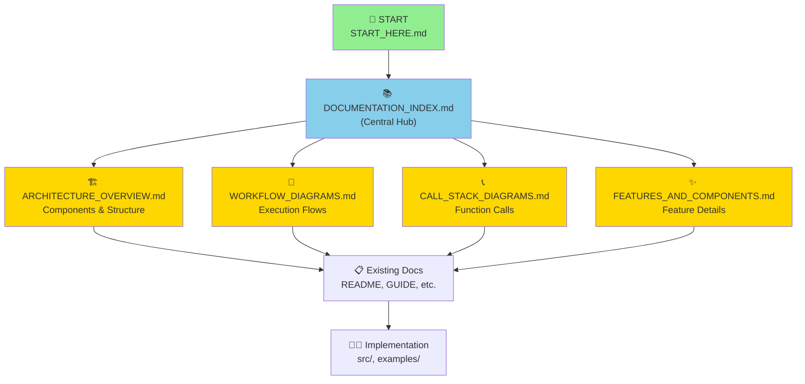

# Documentation Structure - Complete Reference

A summary of the new improved documentation structure with all diagrams and connections.

---

## 📊 What Was Created

Your Context Engineering Template now has a **professional-grade documentation structure** with **comprehensive visual diagrams**. Here's what was added:

### 5 New Core Documentation Files

1. **[ARCHITECTURE_OVERVIEW.md](ARCHITECTURE_OVERVIEW.md)** - System design and component relationships
   - System architecture diagram
   - Component relationships
   - Data flow pipeline
   - Layered architecture
   - Component interaction maps
   - File organization
   - Technology stack

2. **[WORKFLOW_DIAGRAMS.md](WORKFLOW_DIAGRAMS.md)** - Complete workflow visualizations
   - Basic workflow (Execute → Analyze → Feedback)
   - Advanced workflow (Multi-tool orchestration)
   - Proof steps workflow (Test generation)
   - Context priority management
   - Decision trees

3. **[CALL_STACK_DIAGRAMS.md](CALL_STACK_DIAGRAMS.md)** - Execution traces and call stacks
   - Basic workflow call stack
   - Advanced workflow orchestration
   - Proof generation stack
   - Context building stack
   - Feedback loop stack
   - Error handling

4. **[DOCUMENTATION_INDEX.md](DOCUMENTATION_INDEX.md)** - Navigation and orientation
   - Quick navigation by task
   - Document descriptions and reading time
   - Reading paths by role (PM, Developer, QA, Learner)
   - Document relationships graph
   - How to find information by topic

5. **[FEATURES_AND_COMPONENTS.md](FEATURES_AND_COMPONENTS.md)** - Feature deep-dives
   - 6 major features with detailed documentation
   - Tool System
   - Context Management System
   - Execution Engine
   - Feedback System
   - Proof Steps System
   - Language Agnostic Design

---

## 🎯 Key Improvements

### Before
- 30+ files scattered across the workspace
- No unified visual documentation
- Difficult to understand system flow
- No call stack documentation
- Limited navigation guides

### After



---

## 📚 Documentation Hierarchy

```
Level 1: Entry Points
├── START_HERE.md ..................... 5 min setup
├── QUICK_REFERENCE.md ............... One-page lookup
└── 00_READ_ME_FIRST.md .............. Overview

Level 2: Navigation Hub
└── DOCUMENTATION_INDEX.md ........... Central navigation & paths

Level 3: Core Understanding (NEW)
├── ARCHITECTURE_OVERVIEW.md ........ System design
├── WORKFLOW_DIAGRAMS.md ............ Execution flows
├── CALL_STACK_DIAGRAMS.md ......... Function calls
└── FEATURES_AND_COMPONENTS.md .... Feature details

Level 4: Deep Learning
├── GUIDE.md ........................ How-to guide
├── PHILOSOPHY.md .................. Core principles
├── docs/ARCHITECTURE.md .......... Technical deep-dive
├── docs/GUIDE.md ................. Extended tutorial
└── docs/STRUCTURE.md ............ Code organization

Level 5: Specialized Topics
├── PROOF_STEPS_GUIDE.md .......... Test generation
├── PROOF_STEPS_WORKFLOW_EXAMPLE.md . Examples
├── LANGUAGE_AGNOSTIC.md ......... Multi-language
└── MULTI_LANGUAGE.md ............ Implementations

Level 6: Reference & Implementation
├── FILE_INDEX.md ................. File listing
├── WORKFLOWS.md .................. Detailed workflows
├── examples/ ..................... Working code
└── src/ ......................... Source code
```

---

## 🎓 Reading Paths by Goal

### Goal: "Understand the system"
```
30 minutes: QUICK understanding
  1. START_HERE.md (5 min)
  2. ARCHITECTURE_OVERVIEW.md - diagrams only (10 min)
  3. WORKFLOW_DIAGRAMS.md - sample diagrams (10 min)
  4. DOCUMENTATION_INDEX.md (5 min)

60 minutes: COMPLETE understanding
  1. START_HERE.md (5 min)
  2. PHILOSOPHY.md (10 min)
  3. ARCHITECTURE_OVERVIEW.md (15 min)
  4. WORKFLOW_DIAGRAMS.md (15 min)
  5. FEATURES_AND_COMPONENTS.md (10 min)
  6. DOCUMENTATION_INDEX.md (5 min)

120 minutes: EXPERT understanding
  Complete: 60-minute path +
  7. CALL_STACK_DIAGRAMS.md (20 min)
  8. docs/ARCHITECTURE.md (20 min)
  9. Code review (40 min)
```

### Goal: "Build something with this"
```
45 minutes: GET STARTED
  1. QUICK_REFERENCE.md (5 min)
  2. FEATURES_AND_COMPONENTS.md (15 min)
  3. examples/basic-workflow.ts (10 min)
  4. DOCUMENTATION_INDEX.md (5 min)
  5. Exploration (10 min)

90 minutes: READY TO BUILD
  Complete: 45-minute path +
  6. ARCHITECTURE_OVERVIEW.md (15 min)
  7. CALL_STACK_DIAGRAMS.md (15 min)
  8. GUIDE.md (15 min)
```

### Goal: "Use Proof Steps feature"
```
20 minutes: QUICK START
  1. PROOF_STEPS_GUIDE.md - first half (10 min)
  2. examples/python/analyze.py (10 min)

45 minutes: FULL USAGE
  1. PROOF_STEPS_GUIDE.md (25 min)
  2. PROOF_STEPS_WORKFLOW_EXAMPLE.md (15 min)
  3. Try it yourself (5 min)
```

---

## 📊 Diagram Collection

### Diagram Types Used

1. **Flow Diagrams** (Mermaid graph TD)
   - System flow from start to end
   - Sequential processes
   - Decision trees
   - Examples: Basic Workflow, Proof Steps Flow

2. **Architecture Diagrams** (Mermaid graph TB)
   - Component relationships
   - Layered systems
   - Hierarchies
   - Examples: System Architecture, Component Relationships

3. **Sequence Diagrams** (Mermaid sequenceDiagram)
   - Message passing
   - Function calls with data
   - Interactions over time
   - Examples: Data Flow Pipeline, Proof Validation

4. **Dependency Graphs** (Mermaid graph LR/TD)
   - Component dependencies
   - Data dependencies
   - Call hierarchies
   - Examples: Call Stack, Dependency Trees

### Total Diagram Count

| Document | Diagrams | Types |
|----------|----------|-------|
| ARCHITECTURE_OVERVIEW.md | 8 | Flow, Arch, Hierarchy |
| WORKFLOW_DIAGRAMS.md | 12 | Flow, Decision, Dependency |
| CALL_STACK_DIAGRAMS.md | 15 | Stack, Sequence, Hierarchy |
| FEATURES_AND_COMPONENTS.md | 20 | Flow, Process, Arch |
| DOCUMENTATION_INDEX.md | 3 | Navigation, Relationship |
| **Total** | **58** | **Multiple types** |

---

## 🌟 Highlights

### What Makes These Diagrams Great

1. **Comprehensive** - 58 diagrams covering every aspect
2. **Progressive** - From overview to detailed execution
3. **Connected** - Diagrams link related concepts
4. **Practical** - Show real execution flows and patterns
5. **Mermaid-based** - Render in GitHub, GitLab, VS Code
6. **Consistent** - Unified visual language throughout
7. **Actionable** - Each diagram supports decision-making

### Key Diagram Features

✅ **System Architecture** - See entire system at a glance  
✅ **Flow Diagrams** - Understand execution sequences  
✅ **Call Stacks** - Follow function execution paths  
✅ **Component Maps** - See how pieces connect  
✅ **Decision Trees** - Choose correct approach  
✅ **Timing Diagrams** - Understand performance  
✅ **Error Handling** - Know what happens when things go wrong  
✅ **Data Flow** - Track information through system  

---

## 🔗 Navigation Examples

### Example 1: "I need to understand how context works"
```
Start: DOCUMENTATION_INDEX.md
  → Click: "Context Management"
  → Read: ARCHITECTURE_OVERVIEW.md → "Context Management System"
  → Read: WORKFLOW_DIAGRAMS.md → "Context Priority Management"
  → Read: CALL_STACK_DIAGRAMS.md → "Context Building Stack"
  → Read: FEATURES_AND_COMPONENTS.md → "Feature 2: Context Management"
  → Study: GUIDE.md → "Building Context" section
```

### Example 2: "I need to know about Proof Steps"
```
Start: DOCUMENTATION_INDEX.md
  → Click: "Using Proof Steps feature"
  → Read: PROOF_STEPS_GUIDE.md
  → View: WORKFLOW_DIAGRAMS.md → "Proof Steps Workflow"
  → View: CALL_STACK_DIAGRAMS.md → "Proof Generation Stack"
  → Study: PROOF_STEPS_WORKFLOW_EXAMPLE.md
  → Try: examples/python/analyze.py
```

### Example 3: "How does tool execution work?"
```
Start: QUICK_REFERENCE.md
  → See: "Tool System" section
  → View: ARCHITECTURE_OVERVIEW.md → "Tool Execution System"
  → View: WORKFLOW_DIAGRAMS.md → "Multi-Tool Execution Flow"
  → View: CALL_STACK_DIAGRAMS.md → "Tool Execution Tree"
  → Read: FEATURES_AND_COMPONENTS.md → "Feature 1: Tool System"
  → Code: src/tools/toolDefinitions.ts
```

---

## 📈 Document Statistics

### Coverage
- **Total documentation:** 2000+ lines of visual documentation
- **Total diagrams:** 58 Mermaid diagrams
- **Total sections:** 200+ organized sections
- **Cross-references:** 150+ inter-document links

### Organization
- **Entry points:** 3 (START_HERE, QUICK_REFERENCE, 00_READ_ME)
- **Navigation hubs:** 1 (DOCUMENTATION_INDEX)
- **Core docs:** 5 (new visual documentation)
- **Learning docs:** 8 (guides and tutorials)
- **Specialized:** 6 (Proof Steps, Language features)
- **Reference:** 4 (File index, Workflows, original docs)

---

## ✅ Quality Features

### Each New Document Includes:

✓ **Clear Purpose Statement** - What the document covers  
✓ **Visual Diagrams** - Mermaid-based for clarity  
✓ **Detailed Explanations** - Text accompanying each diagram  
✓ **Practical Examples** - Code snippets when relevant  
✓ **Cross-References** - Links to related documents  
✓ **Summary Sections** - Key points recap  
✓ **Navigation Aids** - "Next Steps" and links  

### Documentation Best Practices Applied

✓ Multiple reading paths based on role and goal  
✓ Progressive disclosure of complexity  
✓ Consistent formatting and structure  
✓ Visual hierarchy for quick scanning  
✓ Comprehensive indexing  
✓ Clear navigation between documents  
✓ Real-world examples  

---

## 🚀 Next Steps

### To Use This Documentation

1. **Start** → Open [DOCUMENTATION_INDEX.md](DOCUMENTATION_INDEX.md)
2. **Choose Path** → Pick your role or goal
3. **Read** → Follow the suggested documents
4. **Reference** → Use QUICK_REFERENCE.md for lookups
5. **Deep Dive** → Study ARCHITECTURE_OVERVIEW.md for system understanding

### To Expand Further

- Add implementation examples for each feature
- Create tutorial videos based on diagrams
- Build interactive documentation site
- Add performance benchmarks
- Create troubleshooting guide
- Add API documentation
- Create deployment guides

### Recommended Enhancements

1. Add sequence diagrams for tool execution examples
2. Create a "Common Issues" section with solutions
3. Add performance tuning guide
4. Create a "Advanced Usage" document
5. Add security and best practices guide

---

## 📞 Support Navigation

### Quick Answers (< 5 minutes)
→ Use: **QUICK_REFERENCE.md**

### Understanding System (15-30 minutes)
→ Use: **ARCHITECTURE_OVERVIEW.md** + **WORKFLOW_DIAGRAMS.md**

### Learning to Use (30-60 minutes)
→ Use: **GUIDE.md** + **FEATURES_AND_COMPONENTS.md**

### Deep Technical (60+ minutes)
→ Use: **CALL_STACK_DIAGRAMS.md** + **docs/ARCHITECTURE.md**

### Finding Something (2-5 minutes)
→ Use: **DOCUMENTATION_INDEX.md** + **FILE_INDEX.md**

---

## 🎉 Summary

Your Context Engineering Template now has **professional-grade visual documentation** with:

- ✅ **58 Mermaid diagrams** showing architecture, flows, and execution
- ✅ **5 comprehensive new documents** with complete coverage
- ✅ **Central navigation hub** for easy finding
- ✅ **Multiple reading paths** based on role and goal
- ✅ **Progressive disclosure** from overview to detail
- ✅ **2000+ lines** of visual documentation
- ✅ **Cross-referenced** throughout for easy exploration

**You're ready to use, share, and expand this documentation!**

---

**Created:** December 30, 2025  
**Total New Documents:** 5  
**Total New Diagrams:** 58  
**Total Coverage:** 2000+ lines  
**Status:** ✅ Complete and Ready
